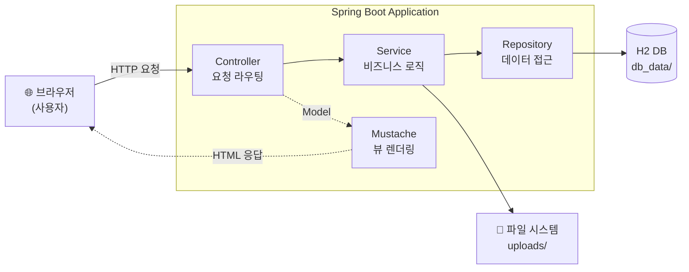

# 📔 사진 일기장 서비스

개인의 소중한 일상을 이미지와 함께 기록하고 소장할 수 있는 개인형 포토 다이어리 서비스입니다.

---

## 1. 서비스 소개

**타겟 사용자:** 소중한 일상을 사진과 함께 기록하고 싶은 모든 사용자

**주요 기능:**

- **콘텐츠 관리 (CRUD):** 이미지 업로드와 함께 일기 작성, 수정, 삭제 기능 제공
- **유효성 검증:** 이미지 포맷(확장자, MIME 타입) 및 용량 제한을 통한 시스템 안정성 확보
- **데이터 익스포트 (Lv3):** 게시글의 메타데이터와 원본 이미지를 하나의 ZIP 파일로 통합 추출 — 인쇄 공정 등에 활용 가능한 구조 제공

---

## 2. 실행 방법 (Docker)

심사관 환경에서 즉시 실행 가능하도록 Docker 환경 설정을 완료했습니다.

```bash
# 1. 환경 변수 준비
cp .env.example .env

# 2. 실행 (빌드 포함)
docker-compose up --build

# 3. 접속
# 브라우저에서 http://localhost:8080 접속
# 포트 변경이 필요한 경우 docker-compose.yml 수정
```

---

## 3. 완성한 레벨

| 레벨 | 기능 | 상태 |
|------|------|------|
| Lv1 | 콘텐츠 관리 | ✅ 완료 |
| Lv2 | 자체 주문 기능 | ✅ 완료 |
| Lv3 | 주문 데이터 익스포트 | ✅ 완료 |

**Lv1 — 콘텐츠 관리**
이미지 업로드를 포함한 일기 게시글의 CRUD 기능을 구현했습니다. 로컬 파일 시스템에 이미지를 저장하며, Docker 볼륨 매핑을 통해 컨테이너 재시작 후에도 데이터가 유지됩니다. 업로드 시 이미지 포맷(확장자, MIME 타입) 및 용량 유효성 검증을 포함합니다.

**Lv2 — 자체 주문 기능**
사용자가 게시글 상세 페이지에서 "인쇄 요청" 버튼을 누르면 주문이 생성되어 관리자용 인쇄 주문 목록에 등록됩니다. 주문은 `pending → processing → completed` 흐름으로 상태가 관리되며, 관리자는 주문 목록에서 각 건의 상태를 조회하고 처리할 수 있습니다.

**Lv3 — 주문 데이터 익스포트**
관리자가 주문 목록에서 "요청 처리" 버튼을 누르면, 해당 주문의 게시글 메타데이터(JSON)와 원본 이미지를 하나의 ZIP 파일로 묶어 다운로드할 수 있습니다. 가상의 인쇄 파트너(스위트북)에게 전달 가능한 구조화된 형태로 데이터를 직렬화하는 것을 목표로 설계했습니다.

---

## 4. 기술 스택 및 아키텍처

| 항목 | 기술 | 선택 이유 |
|------|------|-----------|
| Framework | Spring Boot 3.x | 빠른 프로토타이핑, 높은 생산성, 풍부한 생태계 |
| Language | Java 17 | Spring Boot 호환성 및 타입 안정성 |
| Database | H2 Database (File Mode) | 별도 DB 컨테이너 없이 경량 구동, 파일 모드로 컨테이너 재시작 후에도 데이터 유지 |
| View Engine | Mustache | 서버 사이드 렌더링용 경량 템플릿 엔진, 로직과 뷰의 깔끔한 분리 |

### 아키텍처 다이어그램



> `db_data/`와 `uploads/`는 Docker 볼륨으로 마운트되어 컨테이너 재시작 후에도 데이터가 유지됩니다.

---

## 5. AI 도구 사용 내역

본 프로젝트는 **Gemini**를 기술적 파트너로 활용하여 개발 효율을 높였습니다.

- **설계 보조:** 전체 서비스 아키텍처 및 Docker 인프라 구조 설계
- **코드 최적화:** 파일 I/O 로직에서 `java.nio.file.Path` API 적용 및 예외 처리 가이드 확보
- **문제 해결:** Docker 볼륨 매핑 시 경로 인식 문제(404 에러) 분석, H2 파일 모드에서 데이터 중복 방지(`MERGE INTO`) 로직 도출

---

## 6. 설계 의도 및 소회

**서비스 선택 이유**

스위트북의 인쇄 API 비즈니스를 가장 잘 표현할 수 있는 형태는 "사용자의 콘텐츠가 축적되는 서비스"라고 판단했습니다. 사진 일기는 텍스트와 멀티미디어가 결합된 가장 기본적인 콘텐츠 데이터셋입니다.

**사업성 판단**

최근 개인의 일상을 Vlog 형태로 담는 SNS 트렌드(예: Setlog)에 주목했습니다. 단순히 휘발되는 기록이 아니라, 이를 잘 정제하여 인쇄물이나 디지털 자산으로 변환하는 모델은 충분한 사업성이 있다고 판단했습니다.

**향후 과제**

개발 기간의 제약으로 구현하지 못한 기능들을 추후 고도화하고 싶습니다.

- 회원별 기록 관리 (Multi-tenancy)
- 비밀번호 Hash 도입을 통한 보안 강화

특히 보안 영역은 실제 상용 서비스로 나아가기 위한 필수 요소로 인식하고 있습니다.
